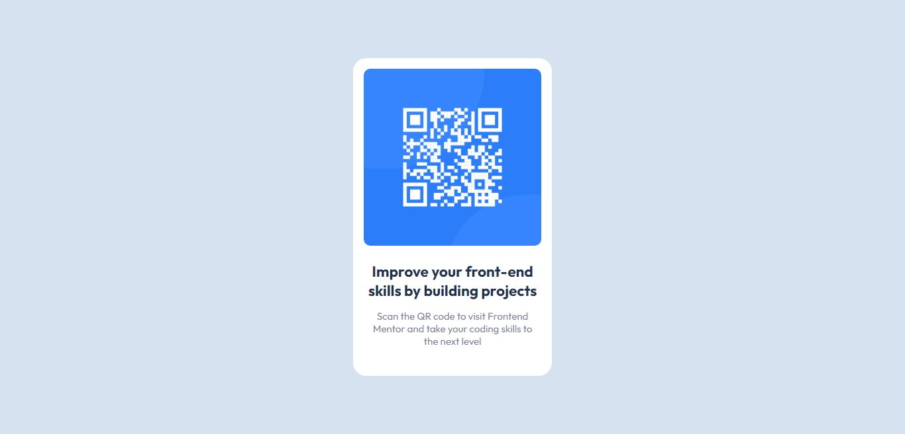

# Frontend Mentor - QR code component solution

🖐️Meu primeiro projeto do site Frontend Mentor.

QR Code component solution

## ⚒️ Tecnologias
- HTML
- CSS
- Git e GitHub

## 💡 O que aprendi
- Flexbox

## 🚀 Links
[🔗 Clique aqui para acessar](https://amanda-silvestre.github.io/qr-code-component/)

🔗 [Meu perfil no Frontend Mentor](https://www.frontendmentor.io/profile/amanda-silvestre)

## 💜 Contato 
🔗 amandasilvestre.dev@gmail.com
